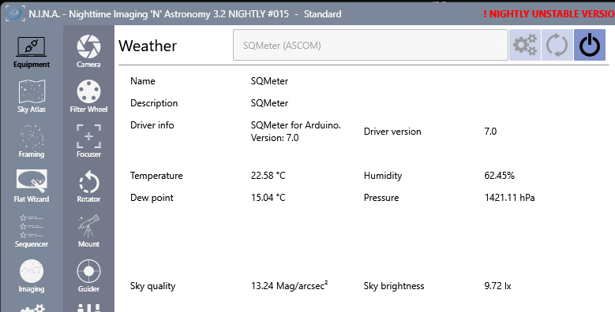
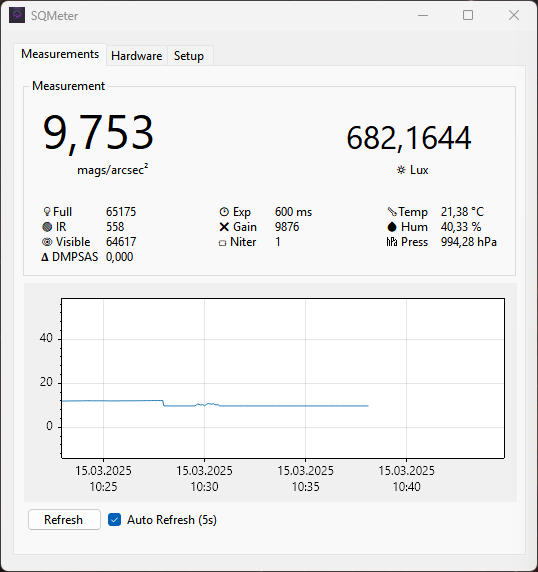
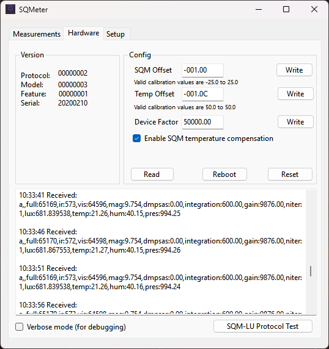
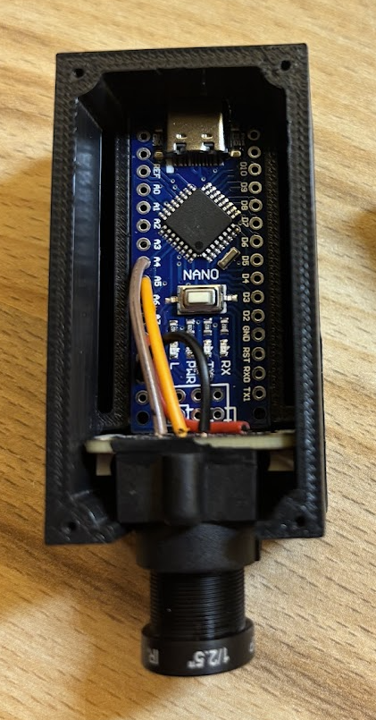
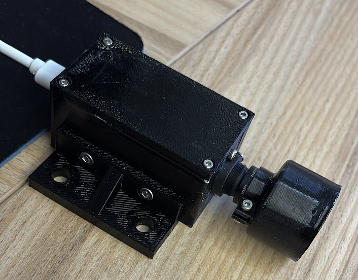

# SQMeter

An **Arduino-compatible Sky Quality Meter** leveraging the **TSL2591** and **BME280** sensors for precise environmental monitoring.

---

## Key Features
### Firmware
- **SQM-LU Serial Protocol**: Compatible with the standard ASCOM driver for Sky Quality Meter and Temperature.
- **Extended Protocol**: Includes additional data points.
- **EEPROM Storage**: Save calibration factors for SQM and temperature directly in EEPROM.
- **Temperature Compensation**: Enhanced accuracy for the TSL2591 sensor with temperature compensation.
### ASCOM Driver
- **ASCOM Platform 7 Driver**: Fully compatible with Weather Conditions.
  - **Data Points**:
    1. Sky Quality
    2. Sky Brightness
    3. Temperature
    4. Humidity
    5. Pressure
    6. Dew Point (calculated)
  - **Customizable Rolling Average**: Configure rolling averages for measurements over a specified time period.
  - **ASCOM Conformance Test**: Successfully passed.
    
### Windows Monitoring Tool
- **Windows Monitoring Tool**: Standalone program for real-time monitoring and configuration.

---

## References

- [SQM GitHub Repository](https://github.com/romanhujer/SQM)
- [SQM_TSL2591 GitHub Repository](https://github.com/gshau/SQM_TSL2591/)

---

## Useful Links

- [ASCOM Driver for SQM-LU](https://www.dizzy.eu/downloads.html)

---

## Building Instructions

### Required Components

- **Arduino Nano**
- **TSL2591 Light Sensor**
- **BME280 Temperature Sensor**
- **3.5mm M12 Lens**
- **M12 Lens Holder**
- **3D Printed Case**

---

## Serial Protocol

### Box Information
- **Request:** `ix`
- **Response:** `i,00000002,00000003,00000001,20191012`

### Read Data
- **Request:** `rx`  
- **Response:** `r, 10.28m,0000000000Hz,0000000002c,000005.000s, 026.2C`
- **Request:** `ux`  
- **Response:** `u, 10.33m,0000000000Hz,0000000004c,000005.000s, 026.4C`

### Read Configuration Data
- **Request:** `gx`
- **Response:** `g, 000.00m, 000.0C,TC:Y`

### Write SQM Offset
*(Value range: -25m to 25m)*
- **Negative Value:**  
  - **Request:** `zcal1-0.05x`
  - **Response:** `z,1,-00.05m`
- **Positive Value:**  
  - **Request:** `zcal100.01x`
  - **Response:** `z,1, 00.01m`

### Erase EEPROM and Reset to Default Values
- **Request:** `zcalDx`
- **Response:** `zxdL`

### Write Temperature Offset
*(Value range: -50°C to 50°C)*
- **Negative Value:**  
  - **Request:** `zcal2-1.5x`
  - **Response:** `z,2,-01.5C`
- **Positive Value:**  
  - **Request:** `zcal2 00.5x`
  - **Response:** `z,2, 00.5C`

### Write Device Factor 
- **Positive Value:**  
  - **Request:** `zcal2 00.5x`
  - **Response:** `z,2, 00.5C`

### Enable SQM Temperature Calibration
- **Request:** `zcalex`
- **Response:** `zxeaL`

### Disable SQM Temperature Calibration
*(Note: Lowercase "d")*
- **Request:** `zcaldx`
- **Response:** `zxdaL`

### Reboot
- **Request:** `qx`
  
### Enable Verbose Mode
- **Request:** `vx`

### Disable Verbose Mode
- **Request:** `yx`
